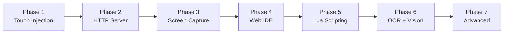

# 🏗️ Kế Hoạch Xây Dựng Lại IOSControl Từ Đầu

> Rebuild từng bước, từ đơn giản → phức tạp. Mỗi phase tự kiểm chứng được trước khi sang phase tiếp.

## Tổng Quan



| Phase | Module                                   | Source tham khảo                                           | Effort   |
| ----- | ---------------------------------------- | ---------------------------------------------------------- | -------- |
| 1     | Theos skeleton + HID Touch               | `Tweak.xm` (L1-690)                                        | 1-2 ngày |
| 2     | HTTP Server + REST API                   | `src/HTTPServer.m` (52KB)                                  | 2-3 ngày |
| 3     | Screen Capture (IOSurface)               | `src/ScreenCapture.m` (33KB)                               | 2-3 ngày |
| 4     | Web IDE Frontend                         | `static/` (index.html, app.js)                             | 3-4 ngày |
| 5     | Lua Scripting Engine                     | `src/LuaEngine.m` (110KB)                                  | 4-5 ngày |
| 6     | OCR + Image Processing                   | `src/OCREngine.m`, `src/ImageFinder.m`, `src/ColorUtils.m` | 3-4 ngày |
| 7     | Advanced (Record, Panel, License, Spoof) | `ICQuickPanel.m`, `LicenseManager.m`, etc.                 | 4-5 ngày |

**Tổng ước tính: ~20-25 ngày**

---

## Phase 1: Theos Skeleton + HID Touch Injection

> **Mục tiêu**: Một tweak chạy trong SpringBoard, inject touch events vào hệ thống.

### [NEW] [Makefile](file:///Users/trieudz/Desktop/Test/Makefile)

- Theos project setup: `ARCHS = arm64`, `TARGET = iphone:clang:latest:15.0`
- Chỉ 1 file source ban đầu: `Tweak.xm`

### [NEW] [Tweak.xm](file:///Users/trieudz/Desktop/Test/Tweak.xm)

Copy và refactor từ IOSControl `Tweak.xm`:

1. **IOHIDEvent function pointers** (L65-85) — `dlsym()` load từ IOKit
2. **ensureScreenSize()** (L95-109) — auto-detect screen dimensions
3. **dispatchTouch()** (L575-690) — core touch injection
4. **API functions**: `ic_tap()`, `ic_swipe()`, `ic_longPress()`, `ic_touchDown/Move/Up()`
5. **showTouchIndicator()** (L493-564) — visual feedback
6. **%ctor** — load IOKit symbols, init HID client

### [NEW] [Entitlements.plist](file:///Users/trieudz/Desktop/Test/Entitlements.plist)

- `com.apple.private.security.container-required: false`
- `platform-application: true`

### [NEW] [control](file:///Users/trieudz/Desktop/Test/control)

- Theos control file (package name, version, description)

### Verification Phase 1

1. `make package` — build thành công
2. Install lên device jailbreak
3. Test qua `curl` hoặc code trực tiếp: gọi `ic_tap(200, 400)` → thấy touch indicator + app respond

---

## Phase 2: HTTP Server + REST API

> **Mục tiêu**: HTTP server chạy trên port 9999, expose REST API cho touch/screen/script.

### [NEW] [src/HTTPServer.h](file:///Users/trieudz/Desktop/Test/src/HTTPServer.h)

### [NEW] [src/HTTPServer.m](file:///Users/trieudz/Desktop/Test/src/HTTPServer.m)

Refactor từ IOSControl `HTTPServer.m` (52KB):

1. **Minimal HTTP parser** — `GCDAsyncSocket` hoặc raw `CFSocket`
2. **Routes cơ bản**:
   - `POST /api/tap` — `{x, y}`
   - `POST /api/swipe` — `{x1, y1, x2, y2, duration}`
   - `POST /api/touch` — `{type, x, y, finger}`
   - `GET /api/screen` — return screenshot (JPEG)
   - `GET /api/status` — device info
3. **CORS headers** — cho Web IDE gọi từ browser
4. **Static file serving** — serve `static/` directory

### [MODIFY] [Tweak.xm](file:///Users/trieudz/Desktop/Test/Tweak.xm)

- Init HTTP server trong `%ctor`
- Wire routes → touch functions

### Verification Phase 2

1. `curl -X POST http://DEVICE_IP:9999/api/tap -d '{"x":200,"y":400}'` → device responds to touch
2. `curl http://DEVICE_IP:9999/api/status` → returns JSON device info
3. Mở browser → `http://DEVICE_IP:9999/` → thấy static page

---

## Phase 3: Screen Capture (IOSurface)

> **Mục tiêu**: Capture system screen, return JPEG qua HTTP API.

### [NEW] [src/ScreenCapture.h](file:///Users/trieudz/Desktop/Test/src/ScreenCapture.h)

### [NEW] [src/ScreenCapture.m](file:///Users/trieudz/Desktop/Test/src/ScreenCapture.m)

Refactor từ IOSControl `ScreenCapture.m` (33KB):

1. **IOSurface capture** — `IOSurfaceAcceleratorCreate` + `IOSurfaceAcceleratorTransferSurface`
2. **CGImage conversion** — `CGBitmapContextCreate` từ IOSurface data
3. **JPEG encoding** — `UIImageJPEGRepresentation` với quality control
4. **Color sampling** — `getColorAtPoint(x, y)` → RGB hex
5. **Rotation handling** — detect & rotate theo device orientation

### [MODIFY] [src/HTTPServer.m](file:///Users/trieudz/Desktop/Test/src/HTTPServer.m)

- `GET /api/screen` → return `ScreenCapture` JPEG
- `GET /api/screen?x=100&y=200` → return color at point
- `GET /api/screen?quality=0.5` → lower quality for speed

### Verification Phase 3

1. `curl http://DEVICE_IP:9999/api/screen -o screen.jpg` → mở file → thấy screenshot
2. `curl http://DEVICE_IP:9999/api/screen?x=100&y=200` → returns `{"color":"#FF5733"}`
3. Chuyển app → capture lại → screenshot hiển thị app đang mở (không chỉ SpringBoard)

---

## Phase 4: Web IDE Frontend

> **Mục tiêu**: Browser-based IDE với live screen, touch control, code editor.

### [NEW] [static/index.html](file:///Users/trieudz/Desktop/Test/static/index.html)

### [NEW] [static/style.css](file:///Users/trieudz/Desktop/Test/static/style.css)

### [NEW] [static/app.js](file:///Users/trieudz/Desktop/Test/static/app.js)

Build từ đầu (không copy 85KB HTML cũ), clean architecture:

1. **Layout**: Sidebar tabs + main content area
2. **Live Screen tab**:
   - Polling JPEG từ `/api/screen` (interval 200ms ban đầu)
   - Click trên image → gửi `/api/tap` với tọa độ chính xác
   - Drag → gửi `/api/swipe`
   - Hiển thị FPS + resolution
3. **Script Editor tab**:
   - Monaco Editor hoặc CodeMirror (CDN)
   - Lua syntax highlighting
   - Run/Stop buttons → `/api/script/run`, `/api/script/stop`
4. **Console tab**: Realtime log output
5. **Files tab**: File browser → `/api/files/list`, `/api/files/read`

### Verification Phase 4

1. Mở `http://DEVICE_IP:9999/` → thấy Web IDE
2. Click vào live screen → device responds
3. Drag trên screen → swipe gesture trên device
4. **User test**: bạn mở browser và thao tác — confirm UX

---

## Phase 5: Lua Scripting Engine

> **Mục tiêu**: Chạy Lua scripts với API `touch.*`, `screen.*`, `sys.*`.

### [NEW] [src/lua/](file:///Users/trieudz/Desktop/Test/src/lua/) (directory)

- Embed Lua 5.4 source (copy từ lua.org — ~30 files .c/.h)

### [NEW] [src/LuaEngine.h](file:///Users/trieudz/Desktop/Test/src/LuaEngine.h)

### [NEW] [src/LuaEngine.m](file:///Users/trieudz/Desktop/Test/src/LuaEngine.m)

Refactor từ IOSControl `LuaEngine.m` (110KB) — build incremental:

**Step 5a**: Lua VM + basic functions

- `luaL_newstate()`, `luaL_openlibs()`
- `sys.toast(msg)`, `sys.sleep(ms)`, `sys.log(msg)`

**Step 5b**: Touch API

- `touch.tap(x, y)`, `touch.down(x, y)`, `touch.up(x, y)`
- `touch.swipe(x1, y1, x2, y2, duration)`
- `touch.move(x, y)`

**Step 5c**: Screen API

- `screen.capture()` → keep current frame
- `screen.getColor(x, y)` → hex color
- `screen.findColor(color, region)` → coordinates
- `screen.isColor(x, y, color, tolerance)`

**Step 5d**: App/System API

- `app.open(bundleID)`, `app.close(bundleID)`
- `app.current()` → foreground app info
- `sys.vibrate()`, `sys.alert(title, msg)`

### [MODIFY] [src/HTTPServer.m](file:///Users/trieudz/Desktop/Test/src/HTTPServer.m)

- `POST /api/script/run` — `{code: "touch.tap(200,400)"}`
- `POST /api/script/stop` — kill running script
- `GET /api/script/status` — running/idle/error

### Verification Phase 5

1. Via HTTP: `curl -X POST .../api/script/run -d '{"code":"touch.tap(200,400); sys.sleep(500); touch.tap(100,300)"}'`
2. Device: thấy 2 tap liên tiếp
3. Web IDE: gõ Lua code, nhấn Run → script thực thi
4. Test error handling: gửi invalid Lua → nhận error message

---

## Phase 6: OCR + Image Processing

> **Mục tiêu**: Nhận dạng text và tìm hình ảnh trên screen.

### [NEW] [src/OCREngine.h](file:///Users/trieudz/Desktop/Test/src/OCREngine.h)

### [NEW] [src/OCREngine.m](file:///Users/trieudz/Desktop/Test/src/OCREngine.m)

Hai lựa chọn (hoặc cả hai):

- **Apple Vision framework** (iOS 13+) — không cần model file, đơn giản nhất
- **Tesseract** — cần build static lib + tessdata

### [NEW] [src/ImageFinder.h](file:///Users/trieudz/Desktop/Test/src/ImageFinder.h)

### [NEW] [src/ImageFinder.m](file:///Users/trieudz/Desktop/Test/src/ImageFinder.m)

### [NEW] [src/ColorUtils.h](file:///Users/trieudz/Desktop/Test/src/ColorUtils.h)

### [NEW] [src/ColorUtils.m](file:///Users/trieudz/Desktop/Test/src/ColorUtils.m)

1. **OCR**: `screen.ocrText(left, top, right, bottom)` → text string
2. **Find Color**: `screen.findColor(color, region, tolerance)` → `{x, y}` hoặc `nil`
3. **Find Multi Color**: `screen.findMultiColor(mainColor, offsets)` → `{x, y}`
4. **Find Image**: `screen.findImage(templatePath, region, similarity)` → `{x, y}`
5. **Compare Image**: pixel-by-pixel hoặc histogram comparison

### Verification Phase 6

1. Capture màn hình có text → `screen.ocrText()` → trả về text đúng
2. `screen.findColor("#FF0000", {0,0,400,800})` → tìm pixel đỏ
3. `screen.findImage("template.png")` → tìm icon trên screen

---

## Phase 7: Advanced Features

> **Mục tiêu**: Hoàn thiện sản phẩm với recording, QuickPanel, license, spoof.

### 7a: Touch Recording + Playback

- Từ `Tweak.xm` L300-L348: swizzle `UIApplication sendEvent:` ghi lại touches
- Generate Lua code từ recorded events
- Playback: replay touch sequence

### 7b: Quick Panel (Volume Button Trigger)

- Từ `ICQuickPanel.m` (22KB): overlay panel khi double-tap volume
- Script selector, record/stop buttons

### 7c: License Manager

- Từ `LicenseManager.m` (22KB): Cloudflare Workers KV verification
- Device UDID binding, premium feature gating

### 7d: Device Spoofing

- Từ `IOSControlSpoof.xm` + `SpoofConfig.m`
- Separate tweak filter — hook `MobileGestalt`, `UIDevice`

### 7e: Script Encryption

- Từ `ScriptEncrypt.m` (12KB): encrypt/decrypt .xxt files

### 7f: WebRTC Live Streaming (Optional — thay thế JPEG polling)

- Native `RTCPeerConnection` + IOSurface video source
- Upgrade từ JPEG polling → real-time P2P stream

### Verification Phase 7

- **User testing**: Double volume down → QuickPanel hiện
- License: mock server verify → premium features unlock
- Recording: touch screen → auto-generate Lua → replay → hành vi giống hệt

---

## Verification Plan (Tổng thể)

### Automated (mỗi phase)

```bash
# Build test — mỗi phase phải compile thành công
make clean && make package

# HTTP API test — Phase 2+
curl -s http://DEVICE_IP:9999/api/status | python3 -m json.tool

# Touch test — Phase 1+
curl -X POST http://DEVICE_IP:9999/api/tap -H "Content-Type: application/json" -d '{"x":200,"y":400}'

# Screen test — Phase 3+
curl -s http://DEVICE_IP:9999/api/screen -o /tmp/test.jpg && file /tmp/test.jpg

# Script test — Phase 5+
curl -X POST http://DEVICE_IP:9999/api/script/run -H "Content-Type: application/json" -d '{"code":"sys.toast(\"Hello from Lua!\")"}'
```

### Manual (User)

1. **Phase 1**: Install tweak → respring → confirm trong log: "IOSControl loaded"
2. **Phase 4**: Mở browser → navigate Web IDE → click/drag trên live screen → confirm device phản hồi đúng
3. **Phase 7**: Double vol-down → QuickPanel popup → chọn script → Run → observe behavior

> [!IMPORTANT]
> Mỗi phase tự chứa và test được riêng. **Không cần hoàn thành phase sau để test phase trước.** Bạn có thể dừng ở bất kỳ phase nào và vẫn có sản phẩm hoạt động.
